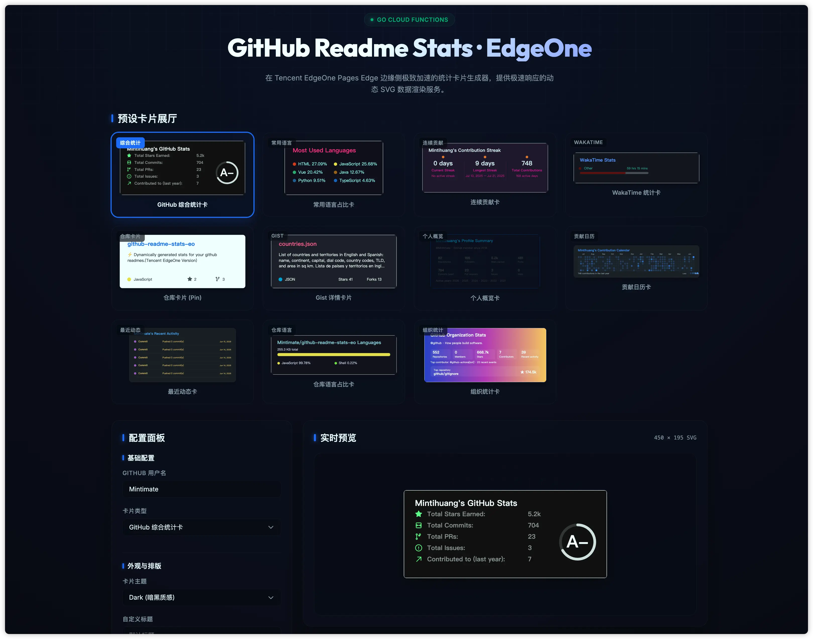

# DevStats

English | [简体中文](README.md)

This project is an extended version of [anuraghazra/github-readme-stats](https://github.com/anuraghazra/github-readme-stats), adding support for the CNB platform, AI evaluation agent, and developer leaderboards, fully adapted for deployment on [Tencent EdgeOne Makers](https://makers.edgeone.ai).

The original project is deployed on Vercel. This version is adapted for EdgeOne Makers Cloud Functions and now includes a Go runtime implementation, keeping the same API interfaces and features, alongside a rich interactive Web frontend.

## Features

- **AI Stats Agent**: Integrates LLMs to automatically analyze your open-source contributions, generate an objective rating, and support streaming chat and smart README generation.
- **Developer Leaderboards**: Automatically indexes evaluated developers, displaying score rankings, platform badges, and capability radars. Compete with top developers anytime.
- **Dynamic Statistics Cards**: Display GitHub or CNB data (commits, PRs, stars, etc.)
- **Multi-Platform Data Sources**: Natively supports GitHub while seamlessly integrating CNB platform data fetching and card rendering.
- **New React Interactive Panel**: Displays multiple cards side-by-side with one-click configuration, debouncing auto-refresh, and real-time Markdown/HTML code generation.
- **Multiple Themes & Layouts**: Full support for original themes, layouts (compact/normal), and custom styling parameters.
- **Go Cloud Functions Backend**: Uses a Go runtime for card rendering with minimal cold starts and high performance; Agent and leaderboard services use Node.js Cloud Functions.
- **Original API Compatible**: Maintains the same query parameters and usage as the original project.

## Interface Preview



## Quick Start

### One-Click Deploy

You can deploy via [Tencent EdgeOne Makers](https://pages.edgeone.ai/en) with one click.

Click the button below to deploy:

[](https://console.cloud.tencent.com/edgeone/pages/new?repository-url=https%3A%2F%2Fgithub.com%2FMintimate%2Fdev-stats)

See [Tencent EdgeOne Makers Documentation](https://pages.edgeone.ai/en/document/product-introduction) for more details.

> **Note**: GitHub requires `PAT_1`; public CNB data does not require a token. See [Environment Variables](#environment-variables).

### Manual Deployment

1. **Fork this repository**
2. **Configure environment variables** (see [Environment Variables](#environment-variables) below)
3. **Deploy to EdgeOne Makers**:
   - Follow the detailed deployment steps below

## Environment Variables

GitHub requires a token; public CNB data does not:

### Required Variables

- **`GITHUB_TOKEN`**: GitHub Personal Access Token
  - Used to call GitHub API to fetch user statistics
  - See [Get GitHub Token](#get-github-token-classic) below for how to obtain
  - Supports multiple tokens (`GITHUB_TOKEN_1`, `GITHUB_TOKEN_2`, etc.) to increase rate limits

### Optional Variables

- **`CNB_API_TOKEN`**: CNB access token
  - Public cards use CNB's web JSON endpoints and do not require a token
  - The token is only a fallback for future restricted Open API features and is never sent to public web endpoints
- Other environment variables from the original project: [Original Project Documentation](https://github.com/anuraghazra/github-readme-stats#customization)

> **Note**: EdgeOne Makers loads environment variables after deployment. After changing environment variables, you need to trigger a new deployment for the changes to take effect.

## Cache Strategy

This project returns `Cache-Control` headers from the functions and configures Pages caching for the main card endpoints in `edgeone.json`:

- `/api`: cached for 1 day by default
- `/api/top-langs`: cached for 6 days by default
- `/api/pin`: cached for 10 days by default
- `/api/gist`: cached for 2 days by default
- `/api/wakatime`: cached for 1 day by default
- `/api/streak` and `/api/contribution-calendar`: cached for 12 hours by default
- `/api/recent-activity`: cached for 1 hour by default
- `/api/profile-summary`, `/api/repo-languages`, and `/api/org`: cached for 1 day by default

Status endpoints are not configured for platform caching, so PAT health and availability checks do not get cached for too long. High-traffic public instances can still place EdgeOne CDN / Cloudflare or another CDN layer in front of the custom domain for more cache control, purge support, and observability.

For example: I use EdgeOne site acceleration in front of EdgeOne Makers for extra CDN cache control:


Corresponding cache rules:


## Technical Architecture

This project is a full-stack Web application:
- **Frontend Interface**: Built with React, offering card previews, Stats Agent chat, code generation, and global leaderboards.
- **Agent and Business Services (TS/Node.js)**: Located in the `agents/` directory, deployed as Cloud APIs via EdgeOne Makers, handling OpenAI/LLM API calls, SSE streaming responses, and KV cache/leaderboard read/write operations. Built-in trusted avatar proxy resolves frontend cross-origin limitations.
- **Card Rendering Engine (Go)**: Located in `cloud-functions/internal`, uses Go to implement ultra-fast SVG rendering, perfectly compatible with original project parameters, and adapted for the CNB platform.

**Card endpoints currently covered by the Go rendering engine:**

- `/api` - GitHub Stats Card
- `/api/top-langs` - Top Languages Card
- `/api/pin` - Repository Pin Card
- `/api/gist` - Gist Card
- `/api/wakatime` - WakaTime Stats Card
- `/api/streak` - Contribution Streak Card
- `/api/profile-summary` - Developer Profile Summary Card
- `/api/contribution-calendar` - Contribution Calendar Card
- `/api/recent-activity` - Recent Public Activity Card
- `/api/repo-languages` - Repository Languages Card
- `/api/org` - GitHub Organization Stats Card
- `/api/status/up` - PAT availability check
- `/api/status/pat-info` - PAT status details

Go Cloud Functions is now the primary implementation, and Node Functions have been removed. The current Go version prioritizes core data and SVG output while continuing to match common themes, layouts, and display parameters from the original project.

### CNB Data Source

Add `platform=cnb` to a card URL to use CNB. GitHub remains the default, so existing URLs do not change.

```md


```

CNB currently supports `/api`, `/api/top-langs`, `/api/pin`, `/api/streak`, `/api/profile-summary`, `/api/contribution-calendar`, `/api/recent-activity`, and `/api/repo-languages`. Gists and organization stats have no equivalent data source and remain GitHub-only. CNB exposes primary/secondary languages rather than byte counts; language cards are weighted by repository occurrence.

## Get GitHub Token (Classic)

1. Go to [Account -> Settings -> Developer Settings -> Personal access tokens -> Tokens (classic)](https://github.com/settings/tokens)
2. Click `Generate new token -> Generate new token (classic)`
3. Check the required permissions:
   - `repo`
   - `read:user`
4. Generate and copy the token (set `GITHUB_TOKEN` equal to this token value in EdgeOne Makers environment variables)

## Deploy to EdgeOne Makers

1. Log in to Tencent EdgeOne console and create a new Pages project
2. Select GitHub as the code source and link this repository; or directly download the repository and manually upload to EdgeOne Makers (will automatically trigger deployment)
3. Set `GITHUB_TOKEN` to the GitHub Token obtained in the previous step in the project's environment variables
4. Since EdgeOne Makers loads environment variables after deployment, you need to trigger another deployment after configuration for the variables to take effect

## Usage

After deployment, visit your EdgeOne Makers domain to see the usage documentation. The API interfaces are fully compatible with the original project.

### Available Endpoints

- `/api` - GitHub Stats Card
- `/api/top-langs` - Top Languages Card
- `/api/pin` - Repository Pin Card
- `/api/gist` - Gist Card
- `/api/wakatime` - WakaTime Stats Card
- `/api/streak` - Contribution Streak Card
- `/api/profile-summary` - Developer Profile Summary Card
- `/api/contribution-calendar` - Contribution Calendar Card
- `/api/recent-activity` - Recent Public Activity Card
- `/api/repo-languages` - Repository Languages Card
- `/api/org` - GitHub Organization Stats Card

For detailed parameters, please refer to the [original project documentation](https://github.com/anuraghazra/github-readme-stats/blob/master/readme.md).

## Example Cards

Copy the following code to your README file (replace with your domain and username):

```md


```

For more styling and parameter configurations (environment variables), please refer to the [original project documentation](https://github.com/anuraghazra/github-readme-stats#customization).

## Related Links

- [Original Repository](https://github.com/anuraghazra/github-readme-stats) - anuraghazra/github-readme-stats
- [EdgeOne Makers Documentation](https://pages.edgeone.ai/en/document/product-introduction)
- [EdgeOne Makers Console](https://console.cloud.tencent.com/edgeone/pages)

## License

This project is open-sourced under the MIT license based on the original project. See [LICENSE](LICENSE) file for details.
